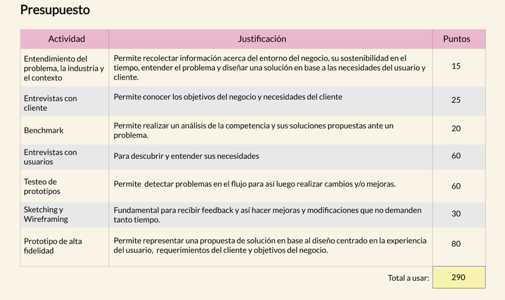
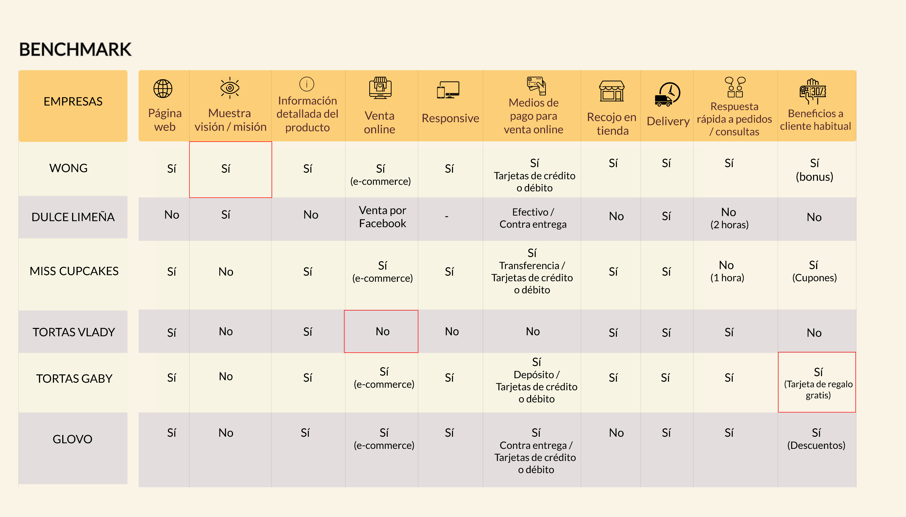
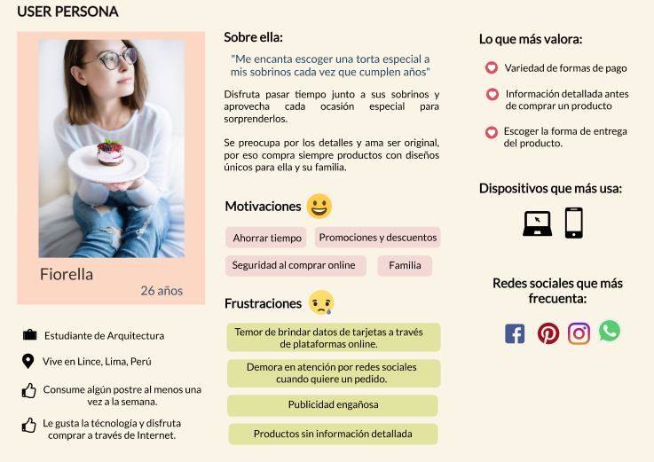
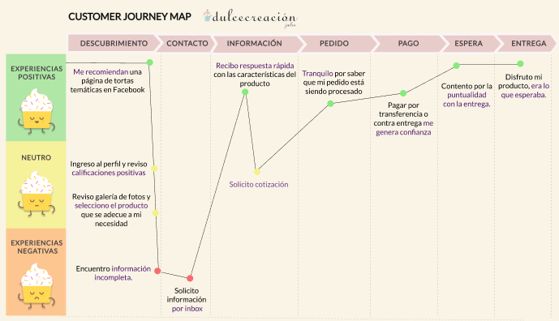

# **Plataforma de ventas en línea: Dulce creación**

## Índice

* [Objetivos del proyecto](#Objetivos-del-proyecto)
* [Entendimiento del problema, la industria y el contexto](#Entendimiento-del-problema)
* [Problemas identificados en la investigación del cliente y del usuario](#Problemas-identificados-en-la-investigación-del-cliente-y-del-usuario)
* [Definición del público objetivo y síntesis de información](#Definición-del-público-objetivo-y-síntesis-de-información)
* [Definición de la solución/producto](#Definición-de-la-solución/producto)
* [Link a prototipo navegable](#Link-a-prototipo-navegable)
* [Explicación de cómo los contenidos y funcionalidades responden a los objetivos del proyecto y resuelven cada uno de las necesidades del usuario final](#Explicación-de-cómo-los-contenidos-y-funcionalidades-responden-a-los-objetivos-del-proyecto-y-resuelven-cada-uno-de-las-necesidades-del-usuario-final)
* [Link de Zeplin](#Link-de-Zeplin)
* [Video Loom explicativo](#Video-Loom-explicativo)

***

## Objetivos del proyecto
Idear una solución e-commerce para Dulce Creación, basada en su modelo de negocio y un diseño centrado en la experiencia de sus usuarios.

#### *Herramientas usadas*

Para realizar este proyecto tuvimos que utilizar una serie de actividades que implementamos en nuestro proceso de UX, las cuales fueron ajustadas en un presupuesto de 290 puntos:

## Entendimiento del problema, la industria y el contexto

Dueña de dulce creación es un emprendimiento con poco tiempo de creado se dedica a la elaboración de tortas y cupcakes situado en  Cuzco, su propietaria Jen Mendoza con experiencia en temas de calidad y temas sociales se mudó a Cuzco hace 2 años y medio y comenzó en diciembre del 2018 este emprendimiento donde coordina el pedido y entrega de sus productos por whatsApp, actualmente es la que se encarga de todo las actividades relacionadas con el negocio, trabaja sola pero  su visión con este emprendimiento no es solo mejorar su situación personal y familiar sino que tiene la meta a largo plazo que al aumentar sus ventas y tenga la necesidad de contratar más mano de obra pueda dar trabajo y capacitación a mujeres en situación económica desfavorable o mujeres víctimas de violencia familiar en la la localidad de San Jerónimo Cuzco y este llegue  a ser un emprendimiento social.

## Problemas identificados en la investigación del cliente y del usuario

#### *Cliente*
[Entrevista a dueña Dulcecreación]("aqui va link de entrevista")

Insights de Dulce creación:
Problemas identificados en la investigación:

- Básicamente lo que Jen necesita es incrementar sus ventas no solo por motivos personales sino también para poder concretar su visión social ya que al haber más pedidos podría contratar a mujeres como mano de obra de dulce creación y brindarles al mismo tiempo capacitación.

- Actualmente da a conocer sus productos por Facebook lo que le demanda tiempo al mandar invitaciones personalizadas a sus contactos de sus cuenta personal asimismo también sale a repartir sus volantes.

- También algunos clientes le solicitan un cita previa para ponerse de acuerdo con las especificaciones de la torta (porciones, sabor, relleno) y temática para lo cual Jen lleva un catálogo para mostrarles.

- Su producto estrella son las tortas temáticas pero además vende tortas no temáticas, cupcakes temáticos/no temáticos y cake pops.

- Las ventas que tiene actualmente se debe a recomendación de sus conocidos y el boca a boca pero ella desearía abarcar más mercado de empresas y familias de todo cuzco así como también turistas donde hay un gran mercado potencial debido al gran flujo que hay en cuzco.

- No cuenta con página web por los costos que le demandaría (dominio, programador, fotógrafo, etc.)

- El canal de comunicación principal que tiene con sus clientes es WhatsApp.

- Actualmente trabaja sola y es la que realiza todas las actividades en su emprendimiento.

- Deben hacerle el pedido con 3 días de anticipación.

Puntos fuertes de Jen:

- La Personalización de su producto (tortas temáticas y no temáticas, relleno, sabor, etc.)

- Cumplimiento de plazos y entrega con puntualidad.

- Buena Calidad de sus productos.

- Las imágenes que cuelga son de sus productos.

- Siempre trata de centrarse en la calidad de la atención.

- Actualmente no tiene local la preparación la realiza en su casa.

#### *Usuarios*
[Encuestas online ](https://docs.google.com/forms/d/1OCtwRTskTwUCD3cPlqPDEpWxnjSHXAoVTI4L0dpBrPY/edit#responses)

[Entrevista a usuarios ]("aqui va link de entrevistas")

Utilizamos entrevistas con usuarios y encuestas online.

Insights de la investigación:
Encontramos lo siguiente:

- El mayor porcentaje de personas prefiere poder escoger pagar con tarjeta de débito/crédito o efectivo. Y la gente que no compra por internet lo hace por la desconfianza en medios de pagos.

- Les molesta cuando las páginas no tienen descripción de los productos ya que no tienen la información necesaria para tomar decisión de compra.

- Valoran el ahorro de tiempo que hacen al hacer el pedido online y poder escoger la entrega con delivery sobre todo si el lugar de recojo queda lejos y el ahorro de pasaje y poder recogerlo en la tienda si les queda cerca o así lo requieren.

- La mayoría de personas tienen experiencia comprando online pero no lo hacen seguido pero les motiva a hacerlo si reciben ofertas y promociones ya que suelen aprovechar y compran si es que las hay.

- Si es la primera vez que compra en esa empresa les gustaría ver recomendaciones en la página.

- Clientes que compran postres por internet desean que las fotos de los productos que la empresa publica corresponda con el producto que se les entrega y no sea una foto sacada de internet.

- Valoran la entrega puntual en plazos establecidos. Sus páginas favoritas online son las que cumplen principalmente esto.

- Otra razón por la que compran online es si son productos que no encuentran en tiendas físicas.

- La mayoría que compra online lo hace en por plataforma de ventas por encima de redes sociales.

- Asimismo deciden comprar por internet si la experiencia es “cómoda” es decir si no tienen ningún problema con la comprar online. Valoran usabilidad de la página esto relacionado con el diseño de la página y estructura del contenido.

- Los usuarios destacan como característica positiva que en el portal web se pueda filtrar características de producto.

- Valoran la calidad del producto, presentación, sabores, Insumos buenos y productos frescos.

- La mayoría prefiere pagar contra entrega.

- No les gusta que haya costos de envío.

- Les parece indispensable que haya buena comunicación. Necesita un canal de comunicación fluido con respecto al estado de su pedido o cualquier otra duda que tengan.

- Si la primera compra es buena tanto por el producto, por plazos y por facilidad de uso de la página continúan comprando en la misma y se fidelizan con la empresa es decir solo siguen comprando si la experiencia que tuvieron fue buena y como esperaban.

#### *Benchmark*

Para que nos sirvió:

El benchmarck nos sirvió para definir qué cosas eran importantes incluir en nuestro portal web hicimos un comparativo con empresas del mismo rubro y otras referencias que eran un buen ejemplo de éxito por su servicio como Wong y Glovo.

- Confirmamos la importancia de dar beneficios al cliente habitual con ofertas/cupones sobre todo en las empresas que tomamos como referencia de éxito en servicio como Wong y Glovo según comentarios de usuarios.

- Todos nuestros referentes mejoran tienen una información detallada del producto.

- La mayoría tiene la opción de recojo en tienda o delivery.
- Casi todos dan varias opciones de pago para escoger al cliente tarjeta de débito/crédito, depósito o efectivo.

- La mayoría con página web e-commerce.

- Y como referencia de servicio vimos que Wong pone su visión/misión que les da un valor agregado.

## Definición del público objetivo y síntesis de información

#### *Afinnity Map*

Realizamos nuestro mapa de afinidad para  encontrar los temas más  recurrentes e importantes para  nuestros usuarios.

Utilizamos la herarmienta online RealtimeBoard el link se encuentra abajo.

[Afinity Map ](https://realtimeboard.com/welcomeonboard/ccjG8e29d0V20xnK449iq2DmP27deLC1YleTjtXCHWl1e4zJPWiJ2wtehD6iVNFk)

#### *User persona*
Ahora que ya sabemos lo que nuestro usuario desea en una compra en el portal web hicimos nuestro user persona.

La representación de nuestro usuario basado en nuestra investigación es el siguiente:

#### *Customer Journey Map (indicando pain y gain points)*

Nos sirvió para identificar que uno de los principales puntos en enfocarnos era las especificaciones de producto, cotización e información que se solicita.

### *Problem statements*

- Cliente necesita ver información detallada del producto para facilitar su decisión de compra.

- Cliente necesita seleccionar la forma de entrega del producto para elegir la que mejor le convenga.

- Cliente necesita disponer de una variedad de formas de pago online para elegir la que sea más accesible para él y/o le genere seguridad.

- cliente necesita incentivos para fidelizarse con la empresa.

### *How Might We-HMW*

- ¿HMW que nuestros usuarios tengan toda la información antes de adquirir un producto?

- ¿HMW para que nuestros usuarios escojan la forma de entrega que más se acomode a sus necesidades?

- ¿HMW para generar en nuestros usuarios una sensación de seguridad al realizar un pago online?

### *What if*

- ¿What if integramos el messenger de Facebook a la tienda online?

- ¿What if se le brinda a los usuarios la opción de pagar por depósito o transferencia en distintos bancos?

- ¿What if los usuarios reciben cupones de descuento por comprar online?

- ¿What if los usuarios no tuvieran que pagar delivery?

- ¿What if se les envía un catálogo online mensual al correo a los usuarios frecuentes con los detalles de los productos en stock actualizada?

## Definición de la solución/producto

Luego de haber realizado la síntesis de la información en el diseño del  portal resaltamos los puntos fuertes del cliente Dulce creación y asimismo el diseño del portal e-commerce incluye las principales características que valoran y necesitan los usuarios.

•	**¿Quiénes son los principales usuarios de producto?**

Son personas que compran habitualmente postres que usan internet para hacer sus compras.

•	**¿Cuáles son los objetivos del negocio en relación con el producto?**

 Se desea que este portal e-commerce aumente las ventas y estas se hagan de manera más eficiente que como se realiza actualmente por WhatsApp.

•	**¿Cuáles son los objetivos de estos usuarios en relación con el producto?**

Hacer la compra de su torta/cupcake por intetnet de manera fácil,agil y que le entreguen el producto que espera en el plazo establecido.

•	**¿Cuál será la propuesta de valor del sitio que vas a crear?**

Comprar tortas personalizadas por internet de manera fácil y confiable.

•	**¿Cuáles son los contenidos que el usuario quiere ver, la información que buscarían para convencerse de comprar, confiar en la empresa que lo ofrece, encontrar lo que busca y comprarlo?**

El usuario puede escoger las características de su producto, precio del producto que desea, recomendaciones en la página libertad de opciones en modalidad de pago y entrega del producto.

•	**¿Cómo vas a distribuir y entregar esos contenidos?**
 A través de un portal e-commerce responsive.

•	**¿Cómo es el flujo que los usuarios que acaben comprando deberán hacer en la web?**

Ingresar a la página,dar click en producto de interés,llenar especificaciones de producto que desea,añadir a carrito,confirmar compra,agregar dedicatoria si deseas para tu producto,elegir opción de entrega,método  de pago,finalizar compra,escoger tipo de comprobante.

•	**¿Cómo crees que el producto les está resolviendo sus problemas?**

Este portal e-commerce aumentará la eficiencia en contacto de clientes, solicitud y entrega de pedidos ya que actualmente se realiza solamente por Facebook y whatsapp además incremente su exposición a diferentes públicos como pobladores de cuzco, turistas, personas jurídicas porque actualmente dueña de dulce creación solo se publicita con sus amigos de Facebook o volantes y principalmente porque mejora la experiencia de compra del usuario al incluir características en la página que él desea o espera por sus anteriores experiencias positivas en compras online y que hemos recogido en la investigación.

## Link a prototipo navegable

[Prototipo ]("aqui va link de prototipo")

## Explicación de cómo los contenidos y funcionalidades responden a los objetivos del proyecto y resuelven cada uno de las necesidades del usuario final.

El diseño del portal e-commerce creado esta realizado en base a la información que recogimos y analizamos en nuestra investigación por lo que está centrado en el usuario y el los objetivos del cliente.

*Implementación de la solución*

•	Apenas se ingresa a la página se ve una selección de imágenes de los productos que vende y en primer lugar en el lugar de la pantalla más estratégico esta su producto estrella las tortas temáticas.
•	Al dar clic en la imagen se muestran los productos de su catálogo y el precio correspondiente.

•	 Clientes puedan ver y escoger las especificaciones del producto como: escoger temáticas, número de porciones, relleno, sabor y ver el precio total resultante de la opción escogida así el cliente cuenta con toda la información.

•	La página incluye métodos de pago más solicitadas por clientes como pago con depósito o transferencia y pago con tarjeta crédito/débito.

•	También cliente tendrá la opción de escoger el tipo de entrega que desean a domicilio (delivery) o recojo en tienda y se coloca el rango de hora en que se entregará el pedido si es delivery y la dirección de la tienda si cliente escogió recojo en tienda.

•	Asimismo el diseño de nuestra página contempla cupón de descuento para incentivar a seguir comprando y premiar así a los clientes recurrentes.

•	También tiene la sección de comentarios de clientes ya que estos valoran mucho poder leerlo antes de realizar la compra.

•	Asimismo para que la experiencia del cliente sea eficiente se le va dando feedback de sus acciones principales como indicarle que ha añadido un producto a su cesta de compras, también al finalizar su pedido se le agradece y se le da su número de pedido.

•	La distribución de la página está centrado en los productos y que intuitivamente el usuario le dé clic pueda ver y escoger las especificaciones del producto que desea y que esto le lleve a comprar.

•	También se comunica en la página que se debe hacer el depósito con mínimo 3 días de anticipación siguiendo el modelo de negocio de Jen dueña de dulce creación.

•	Se ha incluido en el portal actividades que actualmente le demandan tiempo a la dueña de dulce creación y que le ahorrarán como: la elección de especificaciones de la torta que antes tenía que realizar a veces de manera presencial, la publicidad que antes se realizaba boca a boca, en el diseño del portal e-commerce esta la sección donde los usuarios recomiendan y que puede llegar a más personas que lo ve al ingresar a la página.

Esperamos que de implementarse el diseño resulte en un aumento de ventas ya que se espera que con este portal aumente la eficiencia en contacto de clientes, solicitud y entrega de pedidos e incremente su exposición a diferentes públicos como pobladores de cuzco, turistas, personas jurídicas.

## Link de Zeplin

[Zeplin ]("aqui va link de Zeplin")

## Video Loom explicativo

//texto original de github
## Preámbulo

En el mundo hay muchas formas de vender en línea, el porcentaje de compradores
online sigue creciendo y la gama de cosas que pueden comprar también lo hace.
Como compradores no siempre somos conscientes de todo lo que debe pasar para que
los productos que necesitamos estén en una repisa del supermercado o de una
tienda. En el comercio minorista hay una serie de intermediarios que en
ocasiones nos hacen perder la pista del ‘viaje’ de un producto; un viaje que va
encareciendo el producto por cada empresa por la que debe pasar hasta que llega
a las manos de nosotros, los consumidores.
En esta realidad hay dos actores perjudicados: el consumidor, que acaba pagando
más por un producto y el productor o fabricante, que se ve presionado a vender
más barato para que su producto llegue al consumidor a un precio asequible y que
todos puedan beneficiarse en el camino.

## Introducción

### “Nuevo portal de e-commerce”

Nos han contactado de la Asociación Nacional de Pequeños Comerciantes, una
asociación que agrupa a pequeñas y medianas empresas que comercializan productos y servicios, y nos piden
que asesoremos a **uno** de sus miembros en crear un portal desde donde los
clientes compren sus productos sin intermediarios. Los miembros con los que trabajarás son:

- [Dulcecreación](https://www.facebook.com/dulcecreaci%C3%B3n-2077087549044496/)
- [Central Fly](https://www.facebook.com/CENTRALFLY/)
- [Euro Piggy](https://www.facebook.com/EuroPiggy/)
- [Isanka Peruvian Bags](https://www.facebook.com/IsankaPeruvianBags/)
- [Pausa](https://www.facebook.com/pausa.travel/)
- [Centro de Investigación y Desarrollo de Farmacoepidemiología (CID FARMA)](https://www.facebook.com/CIDFARMA/)

Luego de conocer con qué miembro trabajarás, la ANPC te pide que ayudes a ese
miembro a hacer un estudio inicial de cómo debería ser este portal de ventas y
cómo deben ofrecer los productos a los consumidores. Quieren que averigües cómo
son los clientes que utilizaría este canal de venta y cuáles son sus
motivaciones, cómo es el mercado actual en el que incursionarán; y que propongas
una visión de cómo podría plantearse este nuevo canal de ventas.

Una vez conozcas a los posibles compradores debes formular una propuesta de
valor. Esto quiere decir que debes pensar cómo este portal va a comunicar sus
beneficios a los usuarios y cómo va a vender sus productos. Para que guíes a la
empresa que elijas a entender tu visión, esperan que les hagas una propuesta de
cómo podría ser el portal donde las personas puedan buscar, ver, elegir y
comprar sus productos.

## Objetivos de aprendizaje

El objetivo principal de aprendizaje de este proyecto es entender cómo pasamos
de lo que un cliente quiere alcanzar a la definición de un producto digital en
poco tiempo. Entender los principales pasos y preguntas que debemos hacernos,
cómo involucrar a los usuarios y su feedback y cómo usar esos resultados sin
perder de vista los objetivos iniciales.
Esperamos que en este proyecto puedas entender las necesidades y falencias de
las empresas, aprender y empezar a empaparte de los posibles modelos de negocio
así como investigar a su audiencia, los usuarios que consumen sus productos,
entendiendo sus preferencias y contexto en el que lo hacen.

De la misma manera deberás definir cuál es la mejor forma de ofrecerle los
productos de tu cliente a sus usuarios, y, pensando en una propuesta de valor y
sus objetivos. También, deberás definir los contenidos, la interacción y el
diseño del proceso a partir del cual el usuario podrá hacer sus pedidos en esta
plataforma.
Este proyecto se debe "resolver" en parejas, por lo que un objetivo importante
es ganar experiencia en trabajos con entrega grupal. Cada uno de las integrantes
será responsable de una parte del trabajo: (1) el entendimiento del problema y
(2) planeamiento y validación de la solución.

## Tópicos a cubrir

Para completar este proyecto tendrás que familiarizarte con conceptos como: UX
research (entrevistas, benchmark), arquitectura de la información (flujo de
contenido, mapa de sitio), diseño visual y de interacción (wireframes y
prototipado), y user testing.

## Consideraciones generales

Para ser una gran UX no sólo debes familiarizarte con los conceptos sino,
también, poner a prueba tus habilidades blandas. El uso de tu curiosidad y
empatía son claves para el éxito laboral.
Para poder realizar una buena entrevista, un benchmark o un user testing
necesitas en todo momento estar atenta al cómo y no sólo al qué. En este
sentido, es esencial que practiques el modo en que te comunicas frente al
cliente y el usuario. Debes pensar quiénes son y qué es lo que necesitan, y no
sólo enfocarte en lo que tú quieres comunicar.

* Relación con el cliente: la empresa miembro con la que te toque trabajar será
tu cliente. Saber relacionarte con ellos no es fácil. Para comenzar una buena
relación con el cliente debes escuchar de manera activa qué es lo que necesitan,
haciendo preguntas que te ayuden a entender sus necesidades para luego buscar
cómo resolverlas. No trates de dar soluciones inmediatas, escucha y pregunta, la
curiosidad es clave para entender la problemática. El problema del cliente no
siempre es el primero que parece, debes investigar la empresa y la competencia
para entender lo que sucede. Para mantener una buena relación con los clientes
debes mostrarle cómo se beneficiarán de lo que ofreces; enséñale los posibles
resultados y el beneficio que ellos podrían obtener. También debes estudiar las
mejores prácticas en la industria del comercio electrónico para poder mostrarle
al cliente casos de éxito.

* Benchmark: revisar referencias y dar referencias es clave para tu relación con
el cliente. Antes de comenzar a crear cualquier producto debes revisar qué está
haciendo la competencia o industrias similares. De esta manera, puedes traer
buenas prácticas y evitar replicar aquellas que no son exitosas. Esto al cliente
le da la confianza de que efectivamente tienes conocimiento de su problemática y
que has estudiado todas las posibles soluciones. Para que el benchmark sea
efectivo, tu curiosidad y pensamiento crítico deben ser altos; no sólo buscar
las referencias que resulten obvias, sino otras industrias que puedan funcionar
de manera similar o empresas pequeñas que están teniendo casos de éxito.

* Presentación del plan, a dónde vas a ir y por qué: al resolver la problemática
debes realizar un plan de trabajo, donde se visualicen las herramientas que
estás utilizando y por qué las escogiste. No todas las problemáticas requieren
que utilices las mismas herramientas. Debes utilizar la que mejor se ajuste. Es
importante que siempre sustentes tu idea, no se trata de trabajar de manera
mecánica para entregar algo al cliente, sino argumentar por qué esa es la mejor
manera de aproximarse a una posible solución.

* Testing centrado en el usuario: Realizar las pruebas con los usuarios
garantiza que los problemas se detecten antes, las buenas ideas se introducen
más rápido y se reducen los esfuerzos de diseño y desarrollo de productos
innecesarios. Steve Jobs, una vez dijo: "El diseño no es sólo cómo se ve y cómo
se siente. El diseño es cómo funciona”. Las pruebas de usabilidad son una
técnica que ayuda a evaluar un producto al probarlo con usuarios reales. El
testing es una buena forma de profundizar en las necesidades y preferencias de
los usuarios observando sus reacciones mientras usan un producto. Para que el
testing realmente esté centrado en el usuario, tú debes centrarte también en él,
actuando con curiosidad y empatía en todo momento, preguntando de manera activa
al usuario qué podrías mejorar y buscar aquellos errores que llevarán tu
producto al siguiente nivel. No trates de que el usuario apruebe tu producto,
llévalo a buscar las mejoras y posibles errores, generando una relación de
confianza con el usuario.

Tu curiosidad, empatía y pensamiento crítico son claves para tu éxito como UX
Designer. En cada herramienta que utilices debes poner a prueba tus soft skills.
Nunca des nada por supuesto, siempre pregunta hasta encontrar nuevas respuestas,
debes actuar en todo momento con un pensamiento crítico, sino harás de manera
mecánica tus proyectos sin encontrar soluciones innovadoras. Sé una
investigadora, tu curiosidad es clave en los procesos creativos; pregunta
constantemente y no intentes buscar soluciones inmediatas, aprende a navegar con
la incertidumbre. La empatía es la habilidad que te va a guiar en las relaciones
tanto con el cliente como con el usuario, intenta salir de tu mente y tus
supuestos para entender cómo piensan los otros.

## Parte Obligatoria

### 1) General

En este proyecto necesitarás salir a hablar con usuarios reales y entender
cuáles son sus necesidades, cómo las resuelven actualmente y proponer una
solución óptima para resolver estas necesidades. Mientras resuelves el proyecto
vas a tener que ir documentando las actividades que realices a través de fotos,
videos, textos y scripts. Utiliza tu en Google Drive para guardar toda esta
documentación y luego linkea las partes más importantes en el `README.md` de tu
repositorio en GitHub.

En este caso el README.md será la portada de tu solución final, en él tendrás
que mostrar la solución final a través de screenshots y podrás compartir links a
las secciones que detallaremos más adelante.

### 2) Entendimiento del problema

Durante esta parte te asegurarás que el producto que diseñarás es el correcto,
es decir, que sigue objetivos de negocio y que resuelve necesidades reales de
los usuarios. Para ello tendrás que entender al cliente (el miembro de la
Asociación Nacional de Pequeños Comerciantes con quien estás trabajando) y a los
usuarios. Luego de entender el problema, tendrás que plantear cómo es que vas a
resolver dicho problema. Para ello puedes realizar muchas actividades, sin
embargo el tiempo y los recursos que tienes son limitados. Tendrás que elegir
bien qué actividades realizarás.

### 3) Planteamiento y validación de la solución

Luego de haber definido cómo es que será la solución, es decir qué
funcionalidades tendrá y por qué, tendrás que implementarla. En este caso,
tendrás que hacer un prototipo de alta fidelidad y tendrás que validarlo. Cómo
en el caso anterior, para crear y validar la solución puedes realizar muchas
actividades, depende de ti elegir cuáles son las más adecuadas para el caso y
los recursos que tienes.

## Objetivos y presupuesto:

### Objetivo del proyecto:
* Idear una solución e-commerce para Dulce Creación, basada en su modelo de negocio y un diseño centrado en la experiencia de sus usuarios.

Para realizar este proyecto tuvimos que utilizar una serie de actividades que implementamos en nuestro proceso de UX, las cuales fueron ajustadas en un presupuesto de 300 puntos:

|Actividad|Justificación|Puntos|
|:----|:---|:---:|
|Entendimiento del problema, la industria y el contexto| Permite recolectar información acerca del entorno del negocio, su sostenibilidad en el tiempo, entender el problema. | 15 |
|Entrevistas con cliente|Permite conocer los objetivos del negocio y necesidades del cliente. |25|
|Benchmark| Permite realizar un análisis de la competencia y sus soluciones propuestas ante un problema. | 20 |
|Entrevistas con usuarios| Para descubrir y entender sus necesidades | 60 |
|Testeos de prototipos| Permite  detectar problemas en el flujo para así luego realizar cambios y/o mejoras. | 60 |
|Sketching y wireframing| Fundamental para recibir feedback y así hacer mejoras y modificaciones que no demanden tanto tiempo. | 30 |
|Prototipado de alta fidelidad| Permite representar una propuesta de solución en base al diseño centrado en la experiencia del usuario,  requerimientos del cliente y objetivos del negocio.| 80 |
| | |290|

## Entrega

El proyecto será entregado en un repositorio de GitHub. En él deberás agregar
lo siguiente:

README.md  explicando el proceso del proyecto:
* Objetivos del proyecto
* Problemas identificados en la investigación (del cliente y del usuario)
* Definición del público objetivo
    * User persona
    * Customer Journey Map (indicando pain y gain points)
* Definición de la solución/producto
* Link a prototipo navegable
* Explicación de cómo los contenidos y funcionalidades responden a los objetivos
  del proyecto.
* Explicación de cómo los contenidos y funcionalidades resuelven cada uno de las
  necesidades del usuario final.
* Link de Zeplin, InVision inspects o Marvel Hand-offs para compartir tus
  diseños con desarrolladores.

Un video en [Loom](https://www.useloom.com/) de máximo 10 minutos explicando tu documento.
* Estos 10 minutos tienes que utilizarlos para explicar los puntos indicados en
  el `README.md` y para hacer un demo de la solución.

En las otras carpetas del repositorio o en las carpetas de Google Drive podrás
agregar los documentos complementarios que sustenten tu proceso:

* Fotos, videos, guías de las actividades que realizaste
* Flujo de usuario
* Mapa de sitio
* Etc.

## Otras consideraciones

### 1) Planeamiento y presupuesto

Cuando realices el planeamiento de cómo enfrentarás el reto deberás sustentarlo
ante tu cliente y ante un coach. Ellos te darán la aprobación final para seguir
con las actividades planteadas.

### 2) Definición del producto

Al definir el producto recuerda pensar en:

* Quiénes son los principales usuarios de producto
* Cuáles son los objetivos del negocio en relación con el producto
* Cuáles son los objetivos de estos usuarios en relación con el producto
* Cuál será la propuesta de valor del sitio que vas a crear
* Cuáles son los contenidos que el usuarios quiere ver, la información que
  buscarían para convencerse de comprar, confiar en la empresa que lo ofrece,
  encontrar lo que busca y comprarlo
* Cómo vas a distribuir y entregar esos contenidos
* Cómo es el flujo que los usuarios que acaben comprando deberán hacer en la web
* Cómo crees que el producto les está resolviendo sus problemas

### 3) Prototipo de alta fidelidad

Existen varias herramientas que puedes utilizar para crear tu prototipo,
nosotros recomendamos Figma, sin embargo, eres libre de utilizar otras
herramientas como Adobe XD, etc. Si eliges Figma tendrás que usar una
herramienta adicional como Marvel o Invision. Recuerda que el diseño que
trabajes debe seguir los fundamentos de visual design, como: contraste,
alineación, jerarquía, entre otros.

### 4) HTML, CSS y JS
Utiliza los diseños exportados en Zeplin, Handoffs o Inspects y desarrolla **dos vistas como mínimo** (aparte del login)
utilizando las tecnologías web que aprendiste en el common core: HTML, CSS y JS.
Puedes usar los frameworks que quieras. Recuerda que la aplicación tiene que ser
mobile-friendly. Despliega el código en GitHub Pages o Heroku.

## Hacker edition

- En lugar de usar Github para documentar tu proceso de trabajo, documéntalo en
  su propia web, puedes usar Wix, Instapage, Squarespace, Google Sites o crear tu
propia web desde 0.

- Desarrolla **todo el flujo de tu propuesta**
utilizando las tecnologías web que aprendiste en el common core: HTML, CSS y JS.

- Escribe un post en Medium contando tu proceso de investigación

## Evaluación

Recuerda revisar la rúbrica para ver la descripción detallada de cada habilidad
y cada nivel. A continuación presentamos los niveles esperados de cada habilidad
que deberías alcanzar al finalizar este proyecto:

### UX Design

|Habilidad|Nivel Esperado|
|:---|:---:|
|User centricity| 4 |
|Planificación| 3 |
|Entrevistas y testing| 3 |
|Observación| 2 |
|Síntesis de resultados| 3 |
|Flujos de usuario| 3 |
|Arquitectura de la información| 3 |
|Prototyping| 3 |
|Business mindset| 4 |
|Visual Design| 4 |

### Habilidades blandas

|Habilidad|Nivel Esperado|
|:---|:---:|
|Planificación y organización| 4 |
|Autoaprendizaje| 4 |
|Solución de problemas| 4 |
|Dar y recibir feedback| 4 |
|Adaptabilidad| 4 |
|Trabajo en equipo| 4 |
|Comunicación eficaz| 4 |
|Presentaciones| 4 |

//
