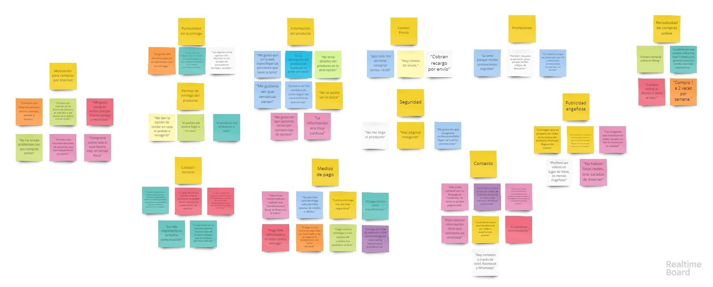

# **Plataforma de ventas en línea: Dulce creación**

## Índice

* [Objetivos del proyecto](#Objetivos-del-proyecto)
* [Entendimiento del problema, la industria y el contexto](#Entendimiento-del-problema)
* [Problemas identificados en la investigación del cliente y del usuario](#Problemas-identificados-en-la-investigación-del-cliente-y-del-usuario)
* [Definición del público objetivo y síntesis de información](#Definición-del-público-objetivo-y-síntesis-de-información)
* [Definición de la solución/producto](#Definición-de-la-solución/producto)
* [Prototipos](#Prototipos)
* [Flujo de usuario](#Flujo-de-usuario)
* [Mapa de sitio](#Mapa-de-sitio)
* [Testing](#Testing)
* [Link a prototipo navegable](#Link-a-prototipo-navegable)
* [Explicación de la solución](#Explicación-de-cómo-los-contenidos-y-funcionalidades-responden-a-los-objetivos-del-proyecto-y-resuelven-cada-uno-de-las-necesidades-del-usuario-final)
* [Link de Zeplin](#Link-de-Zeplin)
* [Video Loom explicativo](#Video-Loom-explicativo)

***
## Objetivos del proyecto:
* Idear una solución e-commerce para Dulce Creación, basada en su modelo de negocio y un diseño centrado en la experiencia de sus usuarios.

## Herramientas y presupuesto:
Para realizar este proyecto tuvimos que utilizar una serie de actividades que implementamos en nuestro proceso de UX, las cuales fueron ajustadas en un presupuesto de 300 puntos:

|Actividad|Justificación|Puntos|
|:----|:---|:---:|
|Entendimiento del problema, la industria y el contexto| Permite recolectar información acerca del entorno del negocio, su sostenibilidad en el tiempo, entender el problema. | 15 |
|Entrevistas con cliente|Permite conocer los objetivos del negocio y necesidades del cliente. |25|
|Benchmark| Permite realizar un análisis de la competencia y sus soluciones propuestas ante un problema. | 20 |
|Entrevistas con usuarios| Para descubrir y entender sus necesidades | 60 |
|Testeos de prototipos| Permite  detectar problemas en el flujo para así luego realizar cambios y/o mejoras. | 60 |
|Sketching y wireframing| Fundamental para recibir feedback y así hacer mejoras y modificaciones que no demanden tanto tiempo. | 30 |
|Prototipado de alta fidelidad| Permite representar una propuesta de solución en base al diseño centrado en la experiencia del usuario,  requerimientos del cliente y objetivos del negocio.| 80 |
| | |290|

## Entendimiento del problema, la industria y el contexto

Dulce creación es una pequeña empresa que se dedica a la elaboración de tortas y cupcakes situado en  Cusco, San Jerónimo. Su propietaria Jen Mendoza, con experiencia en temas sociales y de calidad, comenzó en diciembre del 2018 con este proyecto en donde coordina el pedido y entrega de sus productos mediante WhatsApp. Actualmente, es la que se encarga de todas las actividades relacionadas con el negocio, trabaja sola pero su visión con este emprendimiento va más alla de mejorar su situación personal, económica y familiar. Jen tiene como meta aumentar sus ventas para tener la necesidad de contratar más mano de obra pueda dar trabajo y capacitación a mujeres en situación económica desfavorable o mujeres víctimas de violencia familiar en la la localidad de San Jerónimo Cusco y este llegue a ser un emprendimiento social.

## Problemas identificados en la investigación del cliente y usuario

#### Entrevista a Cliente
[Guía de entrevista a Jen Mendoza, dueña de Dulce Creación](https://drive.google.com/drive/folders/1Anvrh80G7BGqfrEP_MbZ_4bQb2ASua6N)

Insights de Dulce creación:

Problemas identificados en la investigación:

- Básicamente lo que Jen necesita es incrementar sus ventas no solo por motivos personales sino también para poder concretar su visión social ya que al haber más pedidos podría contratar a mujeres como mano de obra de dulce creación y brindarles al mismo tiempo capacitación.

- Algunos clientes le solicitan un cita previa para ponerse de acuerdo con las especificaciones de la torta (porciones, sabor, relleno y temática) para lo cual Jen lleva un catálogo para mostrarles.

- Su producto estrella son las tortas temáticas pero además vende tortas no temáticas, cupcakes temáticos/no temáticos, naked cake, y cake pops.

- Las ventas que tiene actualmente se debe a recomendación de sus conocidos y el boca a boca pero ella desearía abarcar más mercado de empresas y familias de todo Cusco, así como también turistas donde hay un gran mercado potencial debido al gran flujo que hay en Cusco.

- No cuenta con página web por los costos que le demandaría (dominio, programador, fotógrafo, etc.)

- El canal de comunicación principal que tiene con sus clientes es WhatsApp.

- Trabaja sola y es la que realiza todas las actividades en su emprendimiento.

- El pedido se realiza con 3 días de anticipación.

- Actualmente no tiene local, la preparación la realiza en su casa.

Puntos fuertes de Jen:

- La personalización de su producto.

- Cumplimiento de plazos y entrega con puntualidad.

- Buena calidad de sus productos.

- Las imágenes que cuelga son de sus productos.

- Siempre trata de centrarse en la calidad de la atención.

#### Entrevista a usuarios:

[Ver encuesta online](https://docs.google.com/forms/d/1OCtwRTskTwUCD3cPlqPDEpWxnjSHXAoVTI4L0dpBrPY/edit#responses)

[Guía de entrevista a usuarios](https://drive.google.com/drive/folders/1YWt8mkqV0G02X34igaSOs_2983dHO933)

Utilizamos entrevistas con usuarios y encuestas online.

Insights de la investigación:

- El mayor porcentaje de personas prefiere poder escoger pagar con tarjeta de débito/crédito o efectivo. Y la gente que no compra por internet lo hace por la desconfianza en medios de pagos.

- Les molesta cuando las páginas no tienen descripción de los productos ya que no tienen la información necesaria para tomar decisión de compra.

- Valoran el ahorro de tiempo que hacen al hacer el pedido online y poder escoger la entrega con delivery sobre todo si el lugar de recojo queda lejos, o poder recogerlo en la tienda si les queda cerca.

- La mayoría de personas tienen experiencia comprando online pero no lo hacen seguido pero les motiva a hacerlo si reciben ofertas y promociones ya que suelen aprovechar y compran si es que las hay.

- Si es la primera vez que compra en esa empresa les gustaría ver recomendaciones en la página.

- Clientes que compran postres por internet desean que las fotos de los productos que la empresa publica corresponda con el producto que se les entrega y no sea una foto sacada de internet.

- Valoran la entrega puntual en plazos establecidos.

- Otra razón por la que compran online es si son productos que no encuentran en tiendas físicas.

- La mayoría que compra online lo hace mediante plataformas de ventas por encima de redes sociales.

- Asimismo deciden comprar por internet si la experiencia es “cómoda” es decir si no tienen ningún problema con la comprar online. Valoran usabilidad de la página esto relacionado con el diseño de la página y estructura del contenido.

- Los usuarios destacan como característica positiva que en el portal web se pueda filtrar características de producto.

- Valoran la calidad del producto, presentación, sabores, Insumos buenos y productos frescos.

- La mayoría prefiere pagar contra entrega.

- No les gusta que haya costos de envío.

- Les parece indispensable que haya buena comunicación. Necesita un canal de comunicación fluido con respecto al estado de su pedido o cualquier otra duda que tengan.

- Si la primera compra es buena tanto por el producto, por plazos y por facilidad de uso de la página continúan comprando en la misma y se fidelizan con la empresa es decir solo siguen comprando si la experiencia que tuvieron fue buena y como esperaban.

#### Benchmark

El benchmarck nos sirvió para definir qué cosas eran importantes incluir en nuestro portal web. Hicimos un comparativo con empresas del mismo rubro y otras referencias que eran un buen ejemplo de éxito por su servicio como Wong y Glovo.

- Confirmamos la importancia de dar beneficios al cliente habitual con ofertas /cupones sobre todo en las empresas que tomamos como referencia de éxito en servicio como Wong y Glovo según comentarios de usuarios.

- Todos nuestros referentes mejoran tienen una información detallada del producto.

- La mayoría tiene la opción de recojo en tienda o delivery.
- Casi todos dan varias opciones de pago para escoger al cliente tarjeta de débito /crédito, depósito o efectivo.

- La mayoría con página web e-commerce.

- Y como referencia de servicio vimos que Wong pone su visión / misión que les da un valor agregado.

## Definición del público objetivo y síntesis de información

#### Afinnity Map

Realizamos nuestro mapa de afinidad para  encontrar los temas más  recurrentes e importantes para  nuestros usuarios, en el obtuvimos algunas conclusiones y matchs:

Utilizamos la herarmienta online RealtimeBoard el link se encuentra abajo.

##### Diseño e implementación del producto:
* Información detallada y concisa
* Fotos reales, con calidad y profesionales del producto
* Recomendación de otros productos al momento de comprar.
* Personalización

##### Dispositivos:
* Celular: permite poder comprar desde cualquier parte.

##### Envío y pago:
* Canales de contacto en caso suceda algún imprevisto con la compra.
* Delivery es la principal opción de los usuarios, siguiendo por recojo en tienda.
* Los usuarios prefieren pagar con tarjetas de débito o credito.

##### Proceso de compra:
* Flujo claro y fácil en el proceso de compra.

##### Motivaciones:
* Descuentos y promociones.
* Puntualidad en la entrega.
* Exclusividad y personalización del producto.
* Buena calidad del servicio y producto.

[Link Afinity Map](https://realtimeboard.com/welcomeonboard/ccjG8e29d0V20xnK449iq2DmP27deLC1YleTjtXCHWl1e4zJPWiJ2wtehD6iVNFk)

#### User persona
Ahora que ya sabemos lo que nuestro usuario desea en una compra en el portal web hicimos nuestro user persona.

La representación de nuestro usuario basado en nuestra investigación es el siguiente:

#### Customer Journey Map (indicando pain y gain points)

Nos sirvió para identificar que uno de los principales puntos en enfocarnos era las especificaciones de producto, cotización e información que se solicita.

### Problem statements

- Cliente necesita ver información detallada del producto para facilitar su decisión de compra.

- Cliente necesita seleccionar la forma de entrega del producto para elegir la que mejor le convenga.

- Cliente necesita disponer de una variedad de formas de pago online para elegir la que sea más accesible para él y/o le genere seguridad.

- Cliente necesita incentivos para fidelizarse con la empresa.

### How Might We-HMW

- ¿HMW que nuestros usuarios tengan toda la información antes de adquirir un producto?

- ¿HMW para que nuestros usuarios escojan la forma de entrega que más se acomode a sus necesidades?

- ¿HMW para generar en nuestros usuarios una sensación de seguridad al realizar un pago online?

### *What if*

- ¿What if integramos el messenger de Facebook a la tienda online?

- ¿What if se le brinda a los usuarios la opción de pagar por depósito o transferencia en distintos bancos?

- ¿What if los usuarios reciben cupones de descuento por comprar online?

- ¿What if los usuarios no tuvieran que pagar delivery?

- ¿What if se les envía un catálogo online mensual al correo a los usuarios frecuentes con los detalles de los productos en stock actualizada?

## Definición de la solución / producto

Luego de haber realizado la síntesis de la información en el diseño del portal, resaltamos los puntos fuertes del cliente Dulce creación y asimismo el diseño del portal e-commerce incluye las principales características que valoran y necesitan los usuarios.

**¿Quiénes son los principales usuarios de producto?**

Son personas que compran habitualmente postres y/o que usan internet para hacer sus compras.

**¿Cuáles son los objetivos del negocio en relación con el producto?**

 Se desea que este portal e-commerce aumente las ventas y estas se hagan de manera más eficiente que como se realiza actualmente por WhatsApp.

**¿Cuáles son los objetivos de estos usuarios en relación con el producto?**

Hacer la compra de su torta/cupcake por intetnet de manera fácil, agil y que le entreguen el producto que espera en el plazo establecido.

**¿Cuál será la propuesta de valor del sitio que vas a crear?**

Comprar tortas personalizadas por internet de manera fácil y confiable.

**¿Cuáles son los contenidos que el usuario quiere ver, la información que buscarían para convencerse de comprar, confiar en la empresa que lo ofrece, encontrar lo que busca y comprarlo?**

El usuario puede escoger las características de su producto, precio del producto que desea, recomendaciones en la página de otros usuarios, libertad de opciones en modalidad de pago y entrega del producto.

**¿Cómo vas a distribuir y entregar esos contenidos?**

 A través de un portal e-commerce responsive.

**¿Cómo es el flujo que los usuarios que acaben comprando deberán hacer en la web?**

Ingresar a la página, dar click en producto de interés, llenar especificaciones de producto que desea ,añadir a carrito, confirmar compra, agregar dedicatoria si deseas para tu producto, elegir opción de entrega, método  de pago, finalizar compra, escoger tipo de comprobante.

**¿Cómo crees que el producto les está resolviendo sus problemas?**

Este portal e-commerce aumentará la eficiencia en contacto de clientes, solicitud y entrega de pedidos ya que actualmente se realiza solamente por Facebook y Whatsapp. Además, incrementará su exposición a diferentes públicos como pobladores de diversos distritos de Cusco, turistas, personas jurídicas porque actualmente dueña de dulce creación solo se publicita con sus amigos de Facebook o volantes y principalmente porque mejora la experiencia de compra del usuario al incluir características en la página que él desea o espera por sus anteriores experiencias positivas en compras online y que hemos recogido en la investigación.

## Prototipos

[Link a prototipos de Baja Fidelidad](https://drive.google.com/drive/folders/1nDOZky9vCNnGG7cwLojivL4t8dch3n1R)

[Link a prototipo navegable de Alta Fidelidad](https://www.figma.com/proto/eBieJSIZXVQVBKtnCdSbIaFZ/MP-Alta-fidelidad-movil?node-id=38%3A65&viewport=318%2C469%2C0.207912&scaling=scale-down)

## Flujo de usuario

En figma:

## Mapa de sitio

## Testing
[Videos y guía de testing](https://drive.google.com/drive/folders/1VOGFRlz7QYSZaE_qx8han1NHxNbj-Vc9)

Finalmente realizamos las sesiones de testing con 10 usuarios en total (5 en los prototipos de baja, y 5 en alta.) Entre ellos estaban personas que les gustaban los postres, personas que compraban por internet y usuarios que no tenían mucho conocimiento del sector. En líneas generales, obtuvimos bastante feedback para iterar nuestros prototipos, los principales recaían en las confirmaciones de las acciones de compra (recordar y mostrar al usuario en una pantalla final qué productos son los que ha comprado, más allá de agradecer por la compra.) Sin embargo, en cuanto al flujo de compra obtuvimos buen feedback de los usuarios que nos dijeron que el proceso de compra era bastante fluido, entendible y sencillo para ellos.

## Explicación de cómo los contenidos y funcionalidades responden a los objetivos del proyecto y resuelven cada uno de las necesidades del usuario final.

El diseño del portal e-commerce creado esta realizado en base a la información que recogimos y analizamos en nuestra investigación por lo que está centrado en el usuario y en los objetivos del cliente.

**Implementación de la solución**

•	Apenas se ingresa a la página se ve una selección de imágenes de los productos que vende y en primer lugar en el lugar de la pantalla más estratégico esta su producto estrella las tortas temáticas.

•	Al dar clic en la imagen se muestran los productos de su catálogo y el precio correspondiente.

•	 Clientes puedan ver y escoger las especificaciones del producto como: escoger temáticas, número de porciones, relleno, sabor y ver el precio total resultante de la opción escogida así el cliente cuenta con toda la información.

•	La página incluye métodos de pago más solicitadas por clientes como pago con depósito o transferencia y pago con tarjeta crédito/débito.

•	También cliente tendrá la opción de escoger el tipo de entrega que desean a domicilio (delivery) o recojo en tienda y se coloca el rango de hora en que se entregará el pedido si es delivery y la dirección de la tienda si cliente escogió recojo en tienda.

•	Asimismo el diseño de nuestra página contempla cupón de descuento para incentivar a seguir comprando y premiar así a los clientes recurrentes.

•	También tiene la sección de comentarios de clientes ya que estos valoran mucho poder leerlo antes de realizar la compra.

•	Para que la experiencia del usuario sea eficiente se le va dando feedback de sus acciones principales como indicarle que ha añadido un producto a su cesta de compras, también al finalizar su pedido se le agradece y se le da su número de pedido.

•	La distribución de la página está centrado en los productos y que intuitivamente el usuario le dé clic pueda ver y escoger las especificaciones del producto que desea y que esto le lleve a comprar.

•	También se comunica en la página que se debe hacer el depósito con mínimo 3 días de anticipación siguiendo el modelo de negocio de Jen dueña de dulce creación.

•	Se ha incluido en el portal actividades que actualmente le demandan tiempo a la dueña de dulce creación y que le ahorrarán como: la elección de especificaciones de la torta que antes tenía que realizar a veces de manera presencial, la publicidad que antes se realizaba boca a boca, en el diseño del portal e-commerce esta la sección donde los usuarios recomiendan y que puede llegar a más personas que lo ve al ingresar a la página.

Esperamos que de implementarse el diseño resulte en un aumento de ventas ya que se espera que con este portal aumente la eficiencia en contacto de clientes, solicitud y entrega de pedidos e incremente su exposición a diferentes públicos como pobladores de cusco, turistas, personas jurídicas.

## Documentación

[Link a Zeplin](https://app.zeplin.io/project/5c66c7f3ad81ec99d90de193)

[Video a Loom explicando el proceso](https://drive.google.com/drive/u/0/folders/18jBqTPQHS00U93g6ga3mRpf7yYRJ41di)

[Carpeta de drive](https://drive.google.com/open?id=1-qfMohVZ-xWf6BdjuBZnVnet_HvIFcfr)
